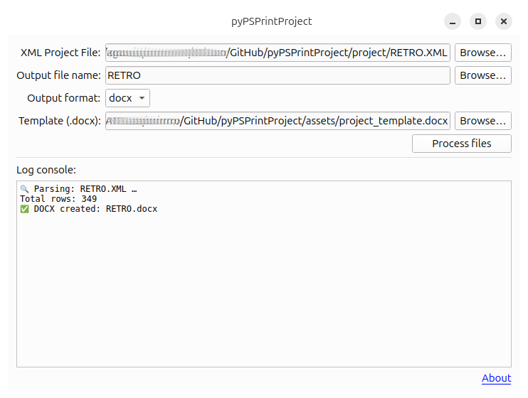
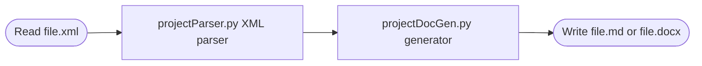

# pyPsPrintProject

Automated tool for generating professional documentation of PeopleSoft projects exported from Application Designer.

[](https://www.python.org/)
[](LICENSE)
[]()



## 📋 Table of Contents

- [Features](#features)
- [Prerequisites](#prerequisites)
- [Quick Start](#quick-start)
- [Basic Usage](#basic-usage)
- [Configuration](#configuration)
- [Project Structure](#project-structure)
- [Supported Definitions](#supported-definitions)
- [Known Limitations](#known-limitations)
- [Troubleshooting](#troubleshooting)
- [License](#license)

## ✨ Features

- 🚀 **UI** - UI built with PySide6 in mind
  - If PySide6 is not installed, then fallbacks to Tkinter
  - If Tkinter is not installed, then returns an error
- ⚙️ **Command line** - now is ```main_cmd.py```
- 📄 **Export to Markdown** - Generate readable and versionable documentation
- 📘 **Export to Word** - Create professional documents with Jinja2 templates
- 🔍 **XML Parser** - Automatically extract definitions from PeopleSoft projects
- 📊 **30+ object types** - Fields, Records, Pages, Components, App Engine, etc
- ⚙️ **Customizable templates** - Use Jinja2 to adapt the format to your needs
- 🤝 **Open Source** - I share this code to the community. Play with it, fork it!

> **Note:** This is an actively developed hobby project. It works very well for most projects, but there may be unsupported edge cases.

## 🔧 Prerequisites

### System
- **Python**: 3.8 or higher
- **pip**: Python package manager
- **OS**: Windows, macOS or Linux

### PeopleSoft
- **Application Designer**: Recommended Version 8.58+
- **Access**: Ability to export projects to XML
- **Knowledge**: Basic familiarity with PeopleSoft project structure

## 📦 Quick Start

### Option 1: Install from source

```bash
# Clone repository
git clone https://github.com/akanashiro/pyPsPrintProject.git
cd pyPsPrintProject

# Install dependencies
pip install -r requirements.txt
```

### Option 2: Manual dependency installation

```bash
pip install docxtpl>=0.16.0 python-docx>=0.8.11
```

### Verify installation

```bash
python main_cmd.py --help
```

### GUI requeriments
**If you want to use Tkinter UI**
```bash
pip install tkinter  (generally included in Python)
pip install ttkthemes
```

**If you want to use PySide6 UI**
```bash
 pip install PySide6
```


You should see the program help without errors.

## 🚀 Basic Usage


### Generate Markdown documentation

```bash
python main.py MyProject.xml --format md --output MyProject.md
```

**Result:** File `MyProject.md` with all definitions documented in Markdown format.


### Generate Word documentation

```bash
python main.py MyProject.xml --format docx --template assets/project_template.docx --output MyProject.docx
```

**Requirement:** Word template with Jinja2 variables such as:
- `{{ project_name }}`
- `{{ project_definitions }}`
- `{{ summary }}`

### View all options

```bash
python main.py --help
```

## ⚙️ Configuration

### Command-line parameters

| Parameter | Short form | Description | Required |
|---|---|---|---|
| `xml_path` | - | Path to XML file | ✅ Yes |
| `--format` | `-f` | `md` or `docx` | ❌ No (default: md) |
| `--template` | `-t` | Path to Word template | ❌ Only for docx |
| `--output` | `-o` | Output file name | ❌ No (default: XML name) |

### Usage examples

```bash
# Simple Markdown
python main_cmd.py project.xml

# Markdown with specific output
python main_cmd.py project.xml -f md -o docs/project.md

# Word with custom template
python main_cmd.py project.xml -f docx -t my_template.docx -o output.docx

# Using absolute paths (recommended for files in other folders)
python main_cmd.py /full/path/project.xml -o /output/path/project.md

# Using GUI (QT interface, fallbacks to Tkinter)
python main.py 

# Explicitly use QT
python mainTk.py

# Explicitly use Tkinter
python mainTk.py
```

### Customize Word templates

Word templates use **Jinja2** for dynamic variables:

```jinja2
{# File: template.docx (edit with Word) #}

Project: {{ project_name }}
Date: {{ generation_date }}
Version: {{ project_version }}

Definitions:
{{ project_definitions }}
```

## 📂 Project Structure

```
pyPsPrintProject/
├── main_cmd.py                # Entry point (CLI)
├── main.py                    # Call graphical interface
├── mainQt.py                  # UI built for PySide6 toolkit
├── mainTk.py                  # UI built for Tkinter toolkit
├── projectParser.py           # Converts XML to Python objects (PSProject, PSField, PSRecord, etc)
├── projectDocGen.py           # Generates Markdown or Word from Python objects
├── helperFunctions.py         # Helper functions. Translates PeopleSoft codes (field types, flags, etc)
├── requirements.txt           # Python dependencies
├── LICENSE                    # MIT License
└── README.md                  # This file
└── assets/
    └── project_template.docx  # Example Word template
```

### Data flow




## 📊 Supported Definitions

### Fully supported ✅

| Object | Details | Notes |
|---|---|---|
| **Field** | Definition + Translate values | - |
| **Record** | Definition + PeopleCode + SQL View | - |
| **Page** | Complete definition | Includes nested components |
| **Component** | Definition + PeopleCode + Record Field PC | PeopleCode nesting |
| **Application Engine** | Do While, Do Select, Do When, Do Until | Includes sections and call sections |
| **Process Definition** | Parameters and configuration | - |
| **Job Definition** | Complete definition | - |
| **SQL Object** | Definition and script | - |
| **File Layout** | Definition | - |
| **BI Publisher Report** | Basic definition | - |
| **Message Catalog** | Error/warning messages | - |
| **Menu** | Definition and structure | - |
| **Role** | Definition and permission list | - |
| **Permission List** | Users and access | Without menu.comp.pages (too much volume) |
| **PS Query** | Basic definition | - |
| **Application Package** | PeopleCode | - |
| **Content Reference** | Folder and Content definition | Basic information |


For partially supported and not supporte definitions, go to CHANGELOG.md

## ⚠️ Known Limitations

### Empty definitions
If the XML contains definitions with a name but empty content, they may not be processed correctly.

**Solution:** Verify that the export is complete in Application Designer.

### Nested objects without parent
Some objects depend on the parent (ex: xlat depends on Field). If the parent is not exported, the nested object does not appear.

**Solution:** Include the parent object in the export.

### Application Engine - Actions without Section
AE actions are only documented if their parent section is included.

**Solution:** Export the complete AE section, not just the actions.

### English only
Currently the tool only generates documentation in English.


## 🐛 Troubleshooting

### DOCX document comes out blank
**Cause:** If you edited template, it may not not have Jinja2 variables or they are incorrectly named.

**Solution:**
1. Edit template in Word
2. Add fields like: `{{ project_name }}`, `{{ definitions }}`
3. Save and run again

---

### Some objects do not appear in the output
**Cause:** Object exists but is empty, or parent is missing.

**Solution:**
1. Verify in Application Designer that the object exists
2. Include the parent object if it depends on another
3. See "Known Limitations" section

---

### Application Engine comes out incomplete
**Cause:** AE section missing from XML.

**Solution:**
```bash
# Make sure to export the complete AE section
# In Application Designer: Project → Tools → Export
# Select the entire AE section
```

---

### Generic error message or crash
1. Verify that the XML is valid (well-formed)
2. Try with a smaller project first

---

## 📄 License

MIT License - See [LICENSE](LICENSE) file for details.

The project is freely available for commercial, personal and educational use.

---

## 🙏 Acknowledgments

- Partners at work

---

**Use in production?**
Not 100% functional but usable.