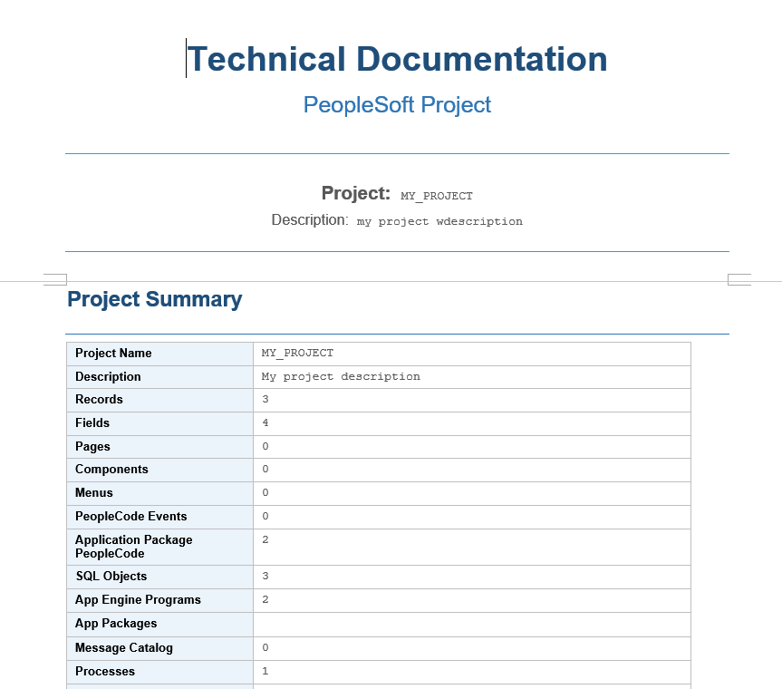
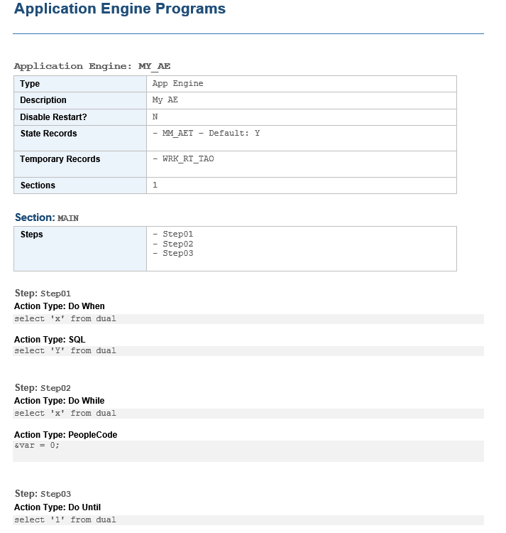

# pyPsPrintProject

Automated tool for generating professional documentation of PeopleSoft projects exported from Application Designer.

[](https://www.python.org/)
[](LICENSE)
[]()



## 📋 Table of Contents

- [Features](#features)
- [Prerequisites](#prerequisites)
- [Quick Start](#quick-start)
- [Basic Usage](#basic-usage)
- [Configuration](#configuration)
- [Project Structure](#project-structure)
- [Supported Definitions](#supported-definitions)
- [Known Limitations](#known-limitations)
- [Troubleshooting](#troubleshooting)
- [License](#license)

## ✨ Features

- 📄 **Export to Markdown** - Generate readable and versionable documentation
- 📘 **Export to Word** - Create professional documents with Jinja2 templates
- 🔍 **XML Parser** - Automatically extract definitions from PeopleSoft projects
- 📊 **30+ object types** - Fields, Records, Pages, Components, App Engine, etc
- ⚙️ **Customizable templates** - Use Jinja2 to adapt the format to your needs
- 🤝 **Open Source** - PeopleSoft community contributing improvements

> **Note:** This is an actively developed hobby project. It works very well for most projects, but there may be unsupported edge cases.

## 🔧 Prerequisites

### System
- **Python**: 3.8 or higher
- **pip**: Python package manager
- **OS**: Windows, macOS or Linux

### PeopleSoft
- **Application Designer**: Version 8.5x+
- **Access**: Ability to export projects to XML
- **Knowledge**: Basic familiarity with PeopleSoft project structure

### Verify Python version
```bash
python --version
```

## 📦 Quick Start

### Option 1: Install from source

```bash
# Clone repository
git clone https://github.com/akanashiro/pyPsPrintProject.git
cd pyPsPrintProject

# Install dependencies
pip install -r requirements.txt
```

### Option 2: Manual dependency installation

```bash
pip install docxtpl>=0.16.0 python-docx>=0.8.11
```

### Verify installation

```bash
python main.py --help
```

You should see the program help without errors.

## 🚀 Basic Usage


### Generate Markdown documentation

```bash
python main.py MyProject.xml --format md --output MyProject.md
```

**Result:** File `MyProject.md` with all definitions documented in Markdown format.

```bash
# Equivalent options (short form)
python main.py MyProject.xml -f md -o MyProject.md
```

### Generate Word documentation

```bash
python main.py MyProject.xml --format docx \
  --template assets/project_template.docx \
  --output MyProject.docx
```

**Requirement:** Word template with Jinja2 variables such as:
- `{{ project_name }}`
- `{{ project_definitions }}`
- `{{ summary }}`

### View all options

```bash
python main.py --help

# Expected output:
# usage: main.py [-h] [--format {docx,md}] [--template TEMPLATE] [--output OUTPUT] xml_path
#
# Documentation generator for PeopleSoft projects
#
# positional arguments:
#   xml_path          Path to XML file exported from Application Designer
#
# optional arguments:
#   -h, --help        show this help message and exit
#   --format {docx,md}, -f {docx,md}
#                     Output format: docx or md (default: md)
#   --template TEMPLATE, -t TEMPLATE
#                     Path to .docx template with Jinja2 markers
#   --output OUTPUT, -o OUTPUT
#                     Output path (extension added automatically)
```

## ⚙️ Configuration

### Command-line parameters

| Parameter | Short form | Description | Required |
|---|---|---|---|
| `xml_path` | - | Path to XML file | ✅ Yes |
| `--format` | `-f` | `md` or `docx` | ❌ No (default: md) |
| `--template` | `-t` | Path to Word template | ❌ Only for docx |
| `--output` | `-o` | Output file name | ❌ No (default: XML name) |

### Usage examples

```bash
# Simple Markdown
python main.py project.xml

# Markdown with specific output
python main.py project.xml -f md -o docs/project.md

# Word with custom template
python main.py project.xml -f docx -t my_template.docx -o output.docx

# Using absolute paths (recommended for files in other folders)
python main.py /full/path/project.xml -o /output/path/project.md
```

### Customize Word templates

Word templates use **Jinja2** for dynamic variables:

```jinja2
{# File: template.docx (edit with Word) #}

Project: {{ project_name }}
Date: {{ generation_date }}
Version: {{ project_version }}

Definitions:
{{ project_definitions }}
```

## 📂 Project Structure

```
pyPsPrintProject/
├── main.py                    # Entry point (CLI)
├── projectParser.py           # XML parser → Python classes (87 KB)
├── projDocGen.py              # MD/DOCX document generator (37 KB)
├── helperFunctions.py         # Helper functions (6.5 KB)
├── requirements.txt           # Python dependencies
├── LICENSE                    # MIT License
├── README.md                  # This file
└── assets/
    ├── project_template.docx  # Example Word template
    └── screenshots/           # Documentation screenshots
```

### Data flow

```
file.xml 
    ↓
projectParser.py (XML parser)
    ↓
PSProject + definitions (Python classes)
    ↓
projDocGen.py (generator)
    ↓
file.md or file.docx
```

### Main modules

- **projectParser.py**: Converts XML to Python objects (PSProject, PSField, PSRecord, etc)
- **projDocGen.py**: Generates Markdown or Word from Python objects
- **helperFunctions.py**: Translates PeopleSoft codes (field types, flags, etc)
- **main.py**: Command-line interface (CLI)

## 📊 Supported Definitions

### Fully supported ✅

| Object | Details | Notes |
|---|---|---|
| **Field** | Definition + Translate values | Types: Char, Long Char, Number, Date, Time, DateTime, Image |
| **Record** | Definition + PeopleCode + SQL View | For Views: auto-generates SELECT |
| **Page** | Complete definition | Includes nested components |
| **Component** | Definition + PeopleCode + Record Field PC | PeopleCode nesting |
| **Application Engine** | Do While, Do Select, Do When, Do Until | Includes sections and call sections |
| **Process Definition** | Parameters and configuration | - |
| **Job Definition** | Complete definition | - |
| **SQL Object** | Definition and script | - |
| **File Layout** | Definition | - |
| **BI Publisher Report** | Basic definition | - |
| **Message Catalog** | Error/warning messages | - |
| **Menu** | Definition and structure | - |
| **Permission List** | Users and access | Without menu.comp.pages (too much volume) |
| **PS Query** | Basic definition | - |
| **Application Package** | PeopleCode | - |



### Partially supported ⚠️

| Object | Limitation | Workaround |
|---|---|---|
| **App Package** | Doesn't generate App Package info | Document manually |
| **Page** | Doesn't generate any image | Document manually |
| **PS Query** | Doesn't distinguish public/private. Doesn't generate SQL| Document manually |
| **REST Service** | Only Operation, not other types | Document manually  |
| **App Engine Steps** | Requires parent section in XML | Export complete section |
| **Record Translate** | Depends on parent Field | Include Field in export |

### Not supported ❌

| Object | Reason | Alternative |
|---|---|---|
| **CSS Styles** | Not relevant for documentation | Document manually |
| **Icons** | Not relevant for documentation | Document manually |
| **Component Record PeopleCode | Not implemented yet | Document manually  |
| **Roles** | Not implemented yet | Document manually  |
| **Content Reference** | Not implemented yet | Document manually |

## ⚠️ Known Limitations

### Empty definitions
If the XML contains definitions with a name but empty content, they may not be processed correctly.

**Solution:** Verify that the export is complete in Application Designer.

### Nested objects without parent
Some objects depend on the parent (ex: xlat depends on Field). If the parent is not exported, the nested object does not appear.

**Solution:** Include the parent object in the export.

### Application Engine - Actions without Section
AE actions are only documented if their parent section is included.

**Solution:** Export the complete AE section, not just the actions.

### English only
Currently the tool only generates documentation in English.

**Solution:** Contributions welcome to add languages.

### Performance with very large projects
Projects with >500 definitions may take a few seconds.

**Solution:** Normal, due to XML parsing and document generation.

## 🐛 Troubleshooting

### Error: "Cannot find file: MyProject.xml"
```
❌ Error: File not found: MyProject.xml
```

**Causes:**
- File does not exist in that location
- Incorrect or relative path

**Solution:**
```bash
# Use absolute path
python main.py C:/Users/me/Documents/MyProject.xml

# Or navigate to the folder first
cd C:/Users/me/Documents/
python main.py MyProject.xml
```

---

### Error: "ModuleNotFoundError: No module named 'docxtpl'"
```
❌ ModuleNotFoundError: No module named 'docxtpl'
```

**Cause:** Dependencies not installed.

**Solution:**
```bash
pip install -r requirements.txt
# Or manually:
pip install docxtpl python-docx
```

---

### Error: "--template required for DOCX format"
```
❌ Error: --template is required to generate DOCX.
```

**Cause:** Missing Word template when using `-f docx`.

**Solution:**
```bash
# Include template
python main.py project.xml -f docx -t template.docx

# Or use example template
python main.py project.xml -f docx -t assets/project_template.docx
```

---

### DOCX document comes out blank
**Cause:** Template does not have Jinja2 variables or they are incorrectly named.

**Solution:**
1. Edit template in Word
2. Add fields like: `{{ project_name }}`, `{{ definitions }}`
3. Save and run again

---

### Some objects do not appear in the output
**Cause:** Object exists but is empty, or parent is missing.

**Solution:**
1. Verify in Application Designer that the object exists
2. Include the parent object if it depends on another
3. See "Known Limitations" section

---

### Application Engine comes out incomplete
**Cause:** AE section missing from XML.

**Solution:**
```bash
# Make sure to export the complete AE section
# In Application Designer: Project → Tools → Export
# Select the entire AE section
```

---

### Generic error message or crash
1. Verify that the XML is valid (well-formed)
2. Try with a smaller project first

---

## 📄 License

MIT License - See [LICENSE](LICENSE) file for details.

The project is freely available for commercial, personal and educational use.

---

## 🙏 Acknowledgments

- Partners at work
- Jinja2 and python-docx for excellent libraries

---

**Use in production?**
Not 100% functional but usable.

**Planned future improvements:**
- [ ] Standardize code
- [ ] Refactoring
- [x] Automate ```<root>``` tag addition to XML
- [ ] GUI (graphical interface)
